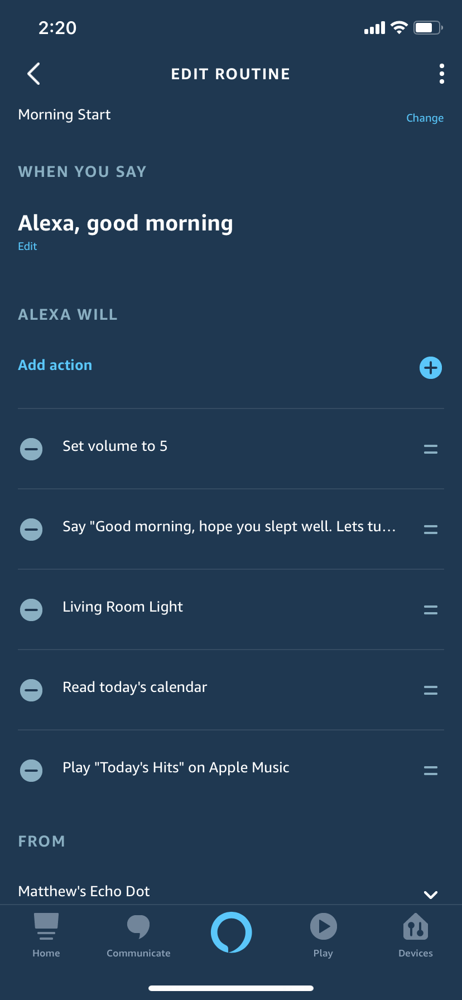

### Objectives

The purposes of this lab are to:
* Automate my morning using Alexa to have her do the following
    * Start playing music
    * Tell me my calendar for the day
    * Turn on my living room light to help my house wake me up
* Build a novel way to see what the weather is going to be like and have it also suggest what I should wear

### Materials

The materials used for this lab were
* Personal computer (For programming the Arduino)
* Personal smart phone (For configuring Alexa)
* Smart bulb of your choosing (As long as it integrates with Amazon Alexa)
* Apple Music account
* Kasa Account (or whatever account is required for your smart bulb)
* 1 x Echo Dot (or other Amazon Alexa capable device)
* 1 x ESP8266 Wemos D1 Mini (Microcontroller)
* 1 x Breadboard
* 1 x USB -> MicroUSB cable for power and flashing the microcontroller
* 3 x LED lights
* 10 x Female to male jumpers
* 4 x Male to mail jumpers
* 1 x OLED Arduino screen
* 1 x Cardboard box to store it all in

### References

1. [Arduino IDE Examples](https://www.arduino.cc/en/Tutorial/BuiltInExamples)
2. [PubSubClient Docs](https://github.com/knolleary/pubsubclient)
3. [Arduino IDE](https://www.arduino.cc/en/main/software)
4. [Install Home Assistant](https://www.home-assistant.io/getting-started/)
5. [Connecting Home Assistant to WiFi](https://unix.stackexchange.com/questions/420640/unable-to-connect-to-any-wifi-with-networkmanager-due-to-error-secrets-were-req)
6. [Connecting Home Assistant to IFTTT](https://www.home-assistant.io/integrations/ifttt/)

### Procedures

#### Setting Up Alexa

1. Plug in your new Echo Dot (or other device)
2. Download the Alexa App ([iOS](https://itunes.apple.com/us/app/amazon-alexa/id944011620?mt=8&at=1001lnRX&ct=tomsguide-1456038539298567853) or [Android](https://play.google.com/store/apps/details?id=com.amazon.dee.app&hl=en_US))
3. Select `Devices` on the lower right hand corner
4. Press the ➕ in the top right of the screen and select `Add Device`
5. Select `Amazon Echo` from the list
6. Select your model (in my case it is an Echo Dot)
    * I then select 3rd generation because that's the one I have. Feel free to select whichever version you purchased
7. Now follow the directions on the screen to pair your new device!

#### Setting Up a Routine

Here we are going to set up two different routines: one that starts the morning off and one that ends the morning. The one to start it needs to read you what is going on that day (according to the calendar that we will add), turn on the living room smart light, and start playing some music. The ending routine should stop the music and turn the living room light off in preparation of us leaving the house.

1. Before we can start adding routines, we need to make sure that we have all of the devices and skills we need added to the app
    * _Note: A skill is simply an integration with another app or service that Alexa can then use_
2. First, we'll set up our Apple Music 
    * Click on the hamburger menu in the top left of the screen and select `Skills & Games`
    * Click the 🔍 icon in the top right hand corner and search for `Apple Music`
    * Click on the Apple music skill and click on the `Enable to use` button
    * Now it will prompt you to login with your AppleID. Do this and the skill is activated and ready to use!
    * You can test this by saying _"Alexa, play music form Apple Music"_
    * At this point, you can also make it so that whenever Alexa is asked to play music, she plays it from Apple music by default. You can do this by going to the left hand menu and selecting `Settings` and go to `Music & Podcasts > Default Services`. Here you can set what you would like your defaults to be.
3. Second, we'll set up Google Calendar
    * We are going to add this skill a little bit differently. This time, we want to go to `Settings > Calendar & Email` and select `Add Account`
    * Select your account type
    * Follow the on screen instructions to sign into your account and like your calendar to Alexa. You can also add your email at the same time
4. Lastly, we'll add in our smart light
    * Go to `Devices` in the bottom right hand corner
    * Press the ➕ in the top right of the screen and select `Add Device`
    * Select `Light > [Your brand name]`. I am adding a TP-LINK Kasa light
    * You will then most likely be prompted to set up your device in the lights proprietary app. Do this and then come back to the Alexa app and click discover devices
    * Your device should be found and you can click add. It will then give you some options on naming the light and such

Now, we're ready to set up our routines! We'll start with our morning start route

5. From the Alexa app, click on the hamburger menu on the top left of the screen and select `Routines`
6. Click the ➕ in the top right hand corner to add a new routine
7. Add a routine name (I just selected Morning Start)
8. Add a `When this happens`
    * I chose `Voice` and said when Alexa hears: _"Alexa, good morning"_
9. Now it is time for the meat of the routine: the actions. First we will add an action to set the volume Alexa should speak at in the mornings
    * Select `Add Action > Device Settings > Volume` and set the volume you want Alexa to be at in the morning
10. Next, we want Alexa respond to our good morning
    * Select `Add Action > Alexa Says > Customised`. Here you can tell Alexa to say whatever you want her to in response to your _"good morning"_
11. Next, we want Alexa to turn on our smart light
    * Select `Add Action > Smart Home > [The name of your light]` and click next
    * Choose Power and make sure the switch is On and click next
    * Done!
12. Next, we want Alexa to read us the calendar
    * Select `Add Action > Calendar > Today's Calendar`
    * Click next and you're all set up!
13. Finally, we need to set up Alexa to play Apple Muxic
    * Select `Add Action > Music`
    * Fill out form and select what you want Alexa to play

Now, we will set up the Morning end routine that will run when we leave the house in the morning

14. From the Alexa app, click on the hamburger menu on the top left of the screen and select `Routines`
15. Click the ➕ in the top right hand corner to add a new routine
16. Add a routine name (I just selected Morning End)
17. Add `When this happens`
    * I chose `Voice and said when Alexa hears: _"Alexa, goodbye"_
18. Now time for the actions! First we will add and action to have Alexa respond
    * Select `Add Action > Alexa Says > Customised`. Here you can tell Alexa to say whatever you want her to in response to your _"goodbye"_
19. Next, we want Alexa to turn the music off
    * Select `Add Action > Device Settings > Stop Audio`
    * Select the device to stop
    * Click next to confirm
20. Finally, we want Alexa to turn off the light
    * Select `Add Action > Smart Home > [The name of your light]` and click next
    * Choose Power and make sure the switch is Off and click next
21. Your Alexa and routines are all set up! Give it a test by saying _"Alexa, Good Morning"_ and then, _"Alexa, goodbye"_

#### Setting up The Weather Caja™

The Weather Caja™ is a box that will help me know what I need to do in the mornings. It will read out the forecast for the day and let me know what the current temperature, low temperatures, and high temperatures for the day are. It will do this using and OLED screen and 3 LEDs all run by an ESP8266 microcontroller. 

1. Wire up your OLED screen to your ESP8266 using the following diagram
    
    * D1 is the I²C Clock Pin
    * D2 is the I²C Data Pin
2. Wire up your 3 LEDs to D5, D6, D7 pins
3. Use the code from previous labs to connect the ESP8266 to the internet, specifically WiFi
4. Initialize the display using the following code
```C#
  #include <SPI.h>
  #include <Wire.h>
  #include <Adafruit_GFX.h>
  #include <Adafruit_SSD1306.h>
  #define SCREEN_WIDTH 128
  #define SCREEN_HEIGHT 64
  #define OLED_RESET     -1
  Adafruit_SSD1306 display(SCREEN_WIDTH, SCREEN_HEIGHT, &Wire, OLED_RESET);
```
5. After you have initialized the display begin communication in the setup() function with the following code
```C#
  if (!display.begin(SSD1306_SWITCHCAPVCC, 0x3C)) {
      Serial.println("[OLED]\tSSD1306 allocation failed");
      for(;;);
  }
```
6. Now you can write to the display using the following code
```C#
  display.clearDisplay();
  display.setTextSize(1);
  display.setTextColor(WHITE);
  display.setCursor(0,0);
  // Display static text
  display.println("[Your Text]");
  display.display();
```
7. Now you can write to the screen. 
8. Next, you should use the http client from ESP8266 to get the weather from any API you would like
9. Use the `ArduinoJson` library to parse the JSON payload. 
10. Based on these values from the API, you are able to turn on and off certain lights if the clothes you need to wear need to be lit up
11. Now, you have everything set up for your very own Weather Caja™. You just need to put it all in a box and make it look nice!!

### Certification of Work

I certify that the solution presented in this lab represents my own work. In the case where I have borrowed code or ideas from another person, I have provided a link to the author’s work in the references, and included a citation in the comments of my code. 

-- Matthew Robertson

### Appendix
#### Appendix 1: DIAGRAMS

Alexa Logical Layout 1


Alexa Logical Layout 2


#### Appendix 2: Configs

Morning Start Routine


Morning End Routine


#### Appendix 3: Demo and Images

Weather Caja™ Image


#### Appendix 2: Code
Available on [GitHub](https://github.com/mattrobertson14/it441-final-project)