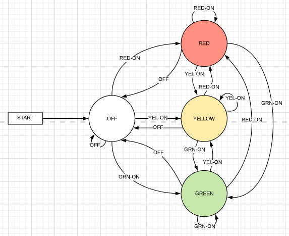
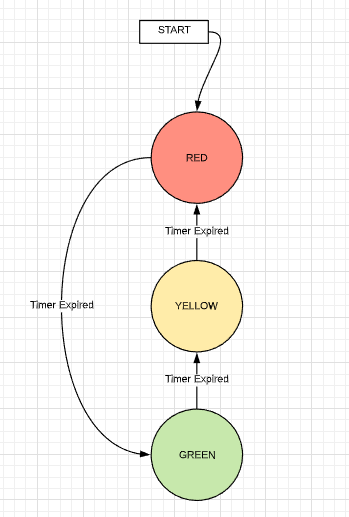
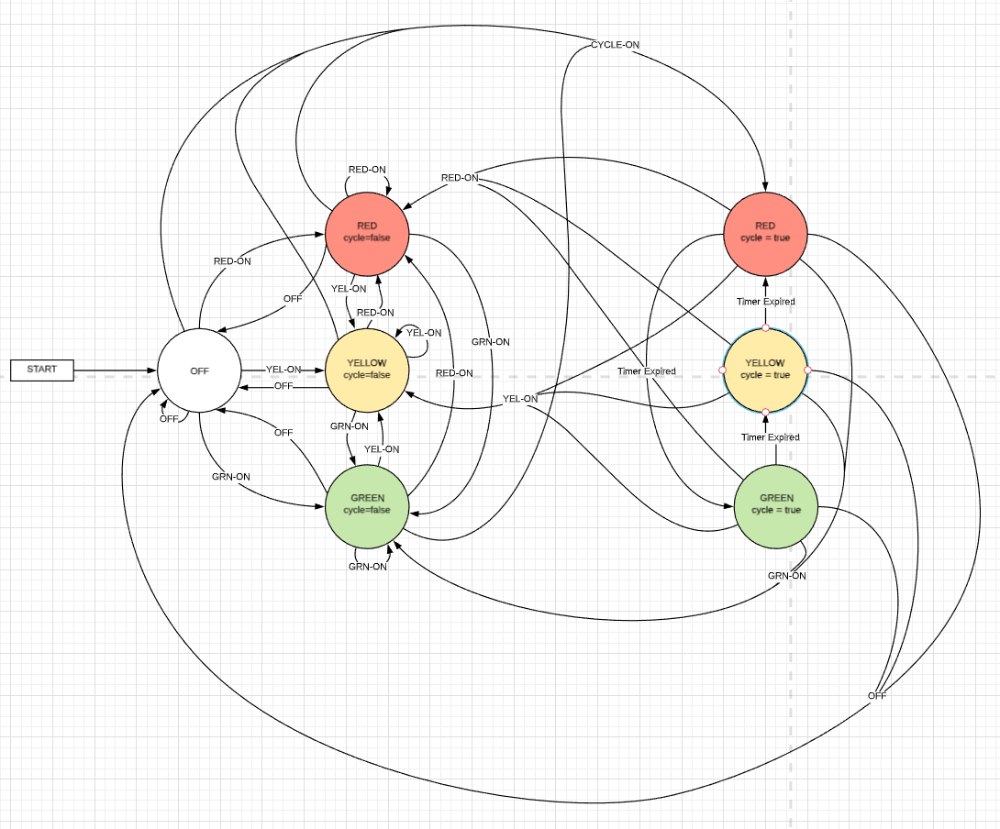
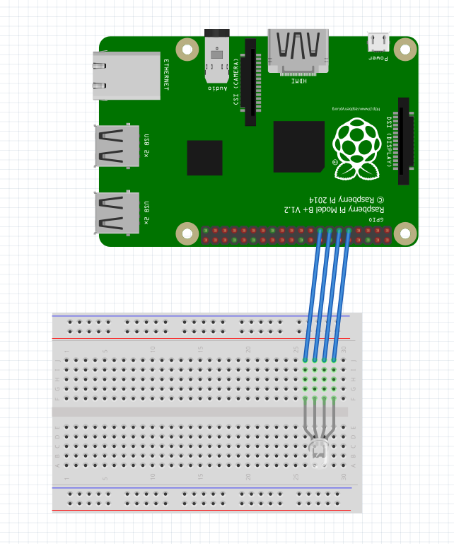
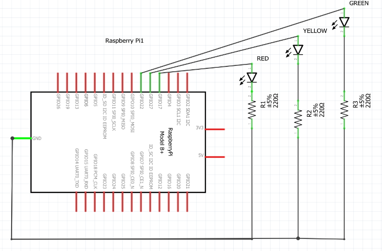
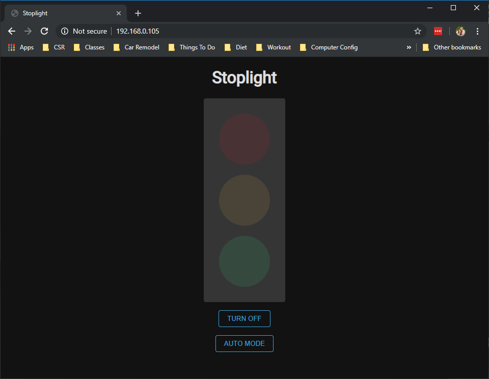
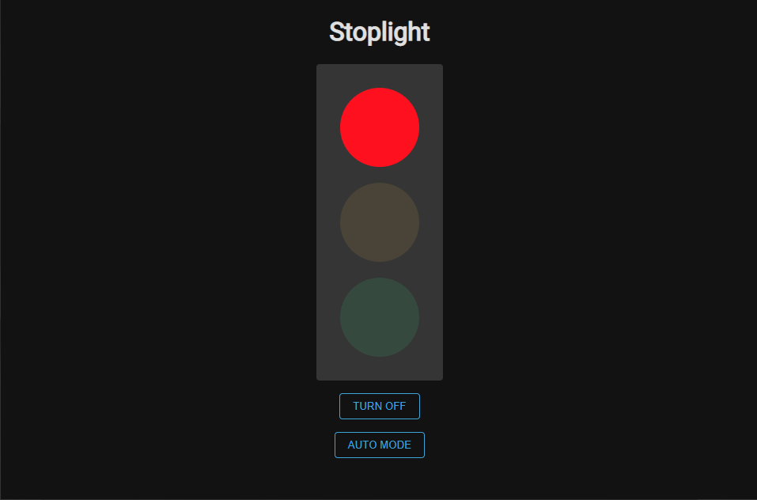
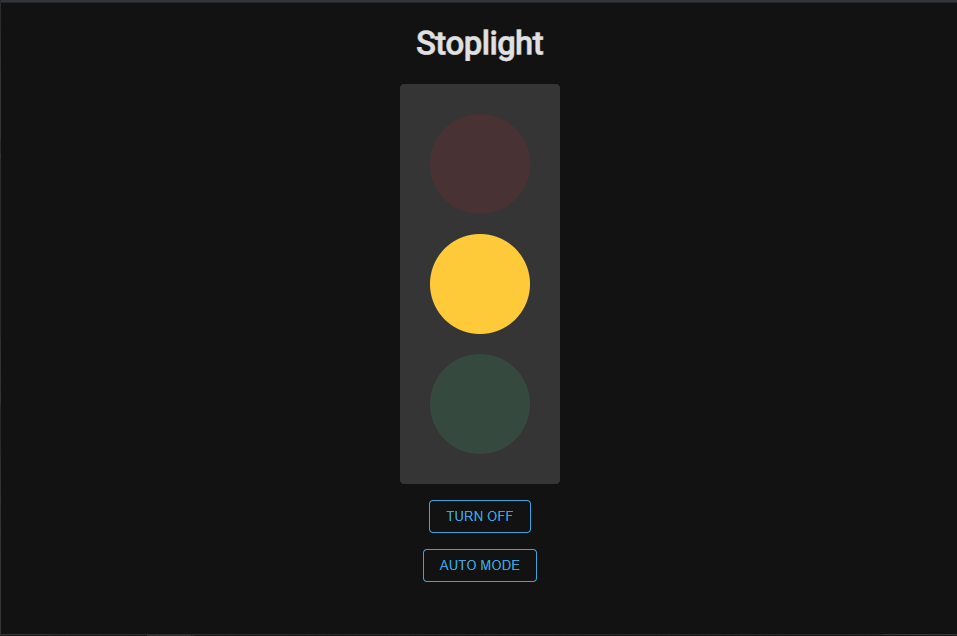
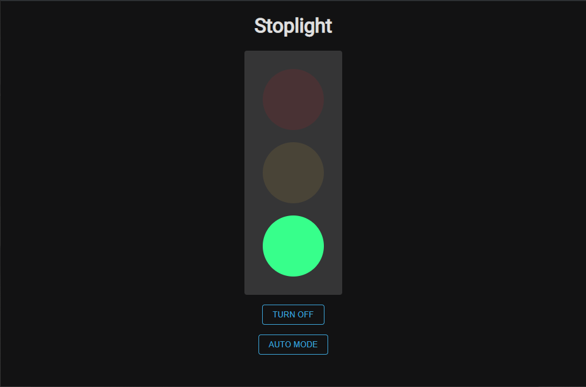
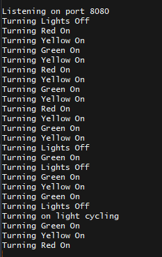

### Objective

The purposes of this lab are to:
* Learn to enumerate requirements from use cases and user stories
* Learn to utilize the general purpose input/output (GPIO) pins on the Raspberry Pi to control LEDs.
* Learn to develop a minimum viable product, and deliver new functionality through subsequent updates until the requirements are met, and all of the deliverables are acceptable.
* Learn to use Github for progressive code commits and version tracking.


### Materials

The materials used for this lab were
* Personal computer (MacBook Pro)
* Monitor, keyboard, mouse, and necessary cables to develop on the pi
* 1 x Raspberry Pi 3 Model B+
* 1 x Breadboard
* 1 x Stop light LED component with built in resistors
* 4 x Female to male jumper cables

### References

1. [Installing Node on a Raspbery Pi](https://www.instructables.com/id/Install-Nodejs-and-Npm-on-Raspberry-Pi/) - This site has a wonderful walk through on how to get NodeJS installed on a Raspberry Pi. Node is what runs the server for this project
2. [Basic Blink Tutorial for NodeJS](https://www.w3schools.com/nodejs/nodejs_raspberrypi_blinking_led.asp) - This is a great tutorial and intro to manipulating GPIO pins on a Raspberry Pi through NodeJS.
3. [NPM rpi-gpio](https://www.npmjs.com/package/rpi-gpio) - This is the package reference to a great library for manipulating GPIO pins on a Raspberry Pi.
4. [Lucidchart](https://www.lucidchart.com/) - A wonderful piece of online software that all the state diagrams were made through
5. [Create React App](https://github.com/facebook/create-react-app) - A wonderful wrapper to quickly create a ReactJS frontend application
6. [ExpressJS](https://expressjs.com/) - The documentation for the library used to create the API in NodeJS
7. [NPM express-promise-router](https://www.npmjs.com/package/express-promise-router) - A useful package for having the Express API be asynchronous 
8. [NPM onoff](https://www.npmjs.com/package/onoff) - The package used in this lab to manipulate GPIO pins
9. [NPM path](https://www.npmjs.com/package/path) - A necessary tool for grabbing relative paths to server up certain files from NodeJS

### Procedures

1. Follow the guide in [Reference 1](https://www.instructables.com/id/Install-Nodejs-and-Npm-on-Raspberry-Pi/) to install NodeJS onto a Raspberry Pi
    * Ensure Node installed by running the following command
    ```bash
    node --version
    ```
    * Ensure npm installed by running the following command
    ```bash
    npm --version
    ```
    * If either of these don’t return a version number, run through the above tutorial again and try to install it again. Also try and check that npm and node were both successfully added to your PATH variable
2. Once that is installed follow the documentation on how to set up a simple NodeJS server [here](https://expressjs.com/en/starter/hello-world.html). The simple NodeJS + ExpressJS server they provide for you is
```javascript
const express = require('express')
const app = express()
const port = 3000
app.get('/', (req, res) => res.send('Hello World!'))
app.listen(port, () => console.log(`Example app listening on port ${port}!`))
```
3. Once that is installed, it is time to create the frontend part of the application. Do this by using the following command 
```bash
npx create-react-app ./
```
4. Once it has been installed in the directory you want, you are ready to start creating your server to serve up the React app and the API server that will manipulate the GPIO pins.
5. Follow the following logical state diagrams to model the data flow on the server side

    * This diagram shows how the data will flow as far as turning the lights on and off through the API and in turn the front-end of the application.
    
    * In this diagram we see the logic of the automatic timer function. This is what the logic should be when the light will act as a normal stoplight would; cycling through its lights on specified intervals.
    * The way these two diagrams talk is that whenever the cycle-on signal is triggered, the lights are turned off and the start point of the cycle is triggered. Whenever any other action is taken, it will then transition back to that state. Here is what the diagrams together look like.
    
6. Once you have your server up and running, you are ready to get your GPIO pins wired up and ready to go. This can be done using the following diagrams (remember, the lights in these diagrams have resistors built into them and that is why they are not on the layout diagram but still show up on the logical one. For the sake of the diagram, the fancy 4-pronged light represents a component that has 3 resisted lights on it and a ground pin all on a integrated board. 


7. Once you have your server and your interface to manipulate the lights, you are ready to start your server. You can do this using node. If you file name was server.js you would start it simply by running
```bash
node server.js
```
8. You can connect to the web page you created by going to `http://[IP-ADDR]:[PORT]`
9. You have now completed a simple stop light with some automation! Congratulations!!
10. If there are any questions or anything, feel free to go to the github repo up at the top of the page to reference the code or just reference the Appendix which will have more screenshots and code snippets.

### Thought Questions
1. **What language did you choose for implementing this project? Why?**<br/>
I chose to do this project in JavaScript. I know this language very well and develop in it every day. Because of this, I felt that I could utilize this knowledge to focusing on learning about the GPIO pins and not nuances of learning a new language.
2. **What is the purpose of the resistor in this simple circuit? What would happen if you omitted it?**<br/>
The resistor takes the load for the circuit so the entire load doesn’t go into the LED’s. The LEDs could probably handle this load but it would shorten the lifespan of the bulb in a big way meaning that it would burn out quicker than if we included the resistors in the circuit.
3. **What are some practical applications for a device similar to this? What enhancements do you think would make this more valuable?**<br/>
The obvious would be a stoplight. Although there is much more logic that goes into them, this seemed like a good foundation to go off of. As well, this would be an interesting idea to see if you could have some kind of status or something along those lines where it told that something was happening based on a light being turned on. One I can think of is if at work, the API could hit some DB and see if someone is scheduled to be in or not at that time. If they are scheduled to be in at that time, their light would be lit up so everyone could  know that they should be on the clock and working. 
4. **Estimate the time you spent on this lab (from start to finish)?**<br/>
I spent about 45 minutes setting up my environment and everything. I spent probably 3 hours on the server itself and another hour on the frontend. The wiring of the pi took me under 5 minutes. Overall, I would say that this project took me about 5 hours to complete.

### Certification of Work

I certify that the solution presented in this lab represents my own work. In the case where I have borrowed code or ideas from another person, I have provided a link to the author’s work in the references, and included a citation in the comments of my code. (I got this statement from the example lab).

-- Matthew Robertson

### Appendix
#### Appendix 1: System Interface - Web Page

State: Startup, /lights-out


State: RED on, during cycle or manual


State: YELLOW on, during cycle or manual


State: GREEN on, during cycle or manual


#### Appendix 2: Server Output


#### Appendix 3: Server Code
Available on [GitHub](https://github.com/mattrobertson14/IT441-Stop-Light)

#### Appendix 4: Front-end Code
Available on [GitHub](https://github.com/mattrobertson14/IT441-Stop-Light)