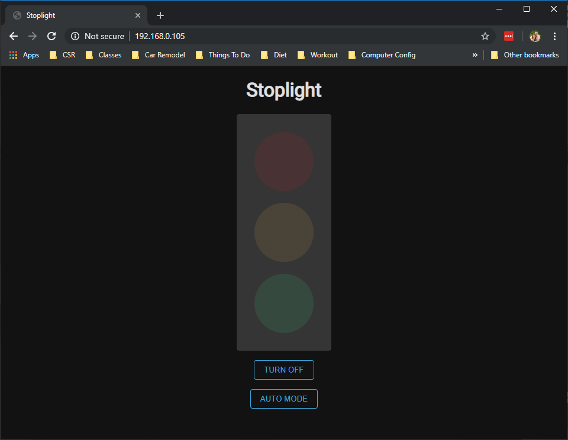
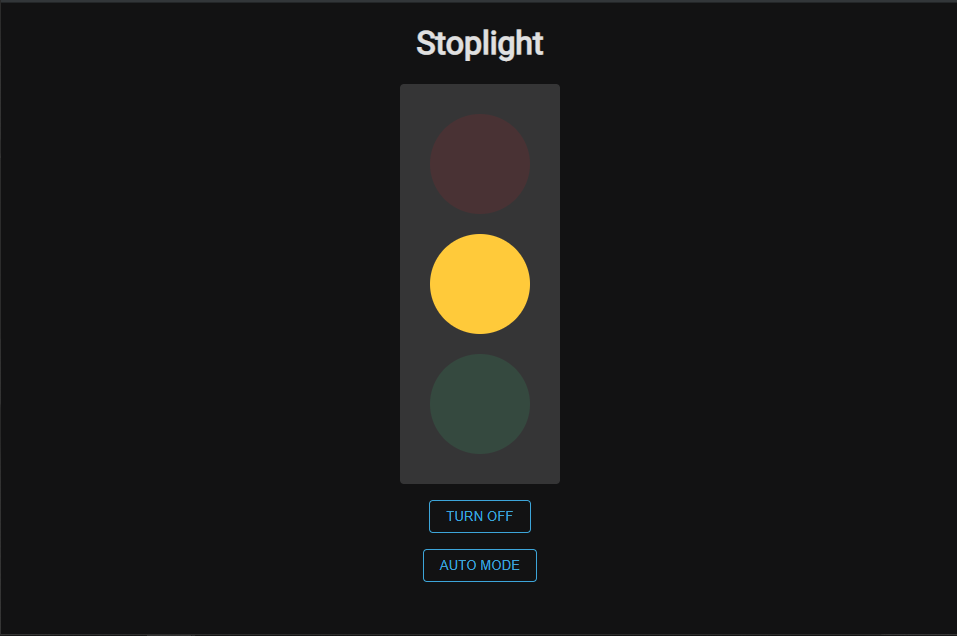

### Objective

The purposes of this lab are to:
* Reinforce enumerating requirements from use cases and user stories
* Become familiar with the Arduino platform and its programming methodologies.
* Program an Arduino-based microcontroller to use the GPIO pins to control LEDs.
* Develop iteratively, beginning with a minimum viable product and add functionality until the requirements are met.

### Materials

The materials used for this lab were
* Personal computer (MacBook Pro)
* 1 x ESP8266 Wemos D1 Mini (Microcontroller)
* 1 x USB -> MicroUSB cable for connecting the Microcontroller to the computer
* 1 x Breadboard
* 1 x Stop light LED component with built in resistors
* 5 x Male to male jumper cables

### References

1. [Arduino IDE Examples](https://www.arduino.cc/en/Tutorial/BuiltInExamples)
2. [ESP8266WebServer Docs](https://github.com/esp8266/Arduino/tree/master/libraries/ESP8266WebServer)
3. [Forum on how to use PROGMEM to store HTML](https://www.esp8266.com/viewtopic.php?f=8&t=4685)
4. [Arduino IDE](https://www.arduino.cc/en/main/software)

### Procedures

1. Install the Arduino IDE from [here](https://www.arduino.cc/en/main/software)
2. Set up your environment to work with the ESP8266 Wemos D1 Mini
    * Go to Preferences and add the following URL to the **Additional Boards Manager URLs** field
    ```md
    http://arduino.esp8266.com/stable/package_esp8266com_index.json
    ```
    * Go to `Tools -> Board: [Some Board Name] -> Boards Manager`
    * Search for _Wemos_
    * Install esp8266 by ESP8266 Community (_Note: this tutorial was made using verions 2.5.2 and does not guarantee that everything will work the exact same in later versions_)
    * Go to `Tools -> Board: [Some Board Name]` again and select the following board
    ```md
    LOLIN(WEMOS) D1 R2 & Mini
    ```
    * Go to `Tools -> Port` and select the port that your Arduino is plugged into. (If you have issues on this step, you can find help [here](https://learn.sparkfun.com/tutorials/usb-serial-driver-quick-install-/all))
    * Go to `Tools -> Erase Flash:` and select `All Flash Contents`
    * You are ready to start coding!
  3. Implement WiFi on the Arduino using the example WiFi setup by going to `File -> Examples -> ESP8266WiFi -> WiFiClientBasic`
  4. After you have tested that you are able to connect to network, you are ready to start setting up your web server. 
  5. Using the docs found for the [ESP8266WebServer Library](https://github.com/esp8266/Arduino/tree/master/libraries/ESP8266WebServer), create a web server that will turn on and off the lights and set them to a cycle mode. For the cycle mode, I would suggest using the millis() library so that you don't lock up your server by using delay()'s.
  6. Once you have all of your code written and you're ready to test it, connect your Arduino to the computer and flash it by going to `Sketch -> Upload`. 
  7. Once it has been flashed, keep it connected and open up the serial monitor (`Tools -> Serial Monitor`) so that you can monitor the server's output.
  8. You have now implemented a stoplight using an Arduino! What else can you do using the same simple libraries??

### Thought Questions

1. #### What are some key differences between developing this lab on a Raspberry Pi, and developing on Arduino?
Developing on a Pi has a lot of overhead. There are a lot of different steps needed to even get the Pi up and running and able to host a web server. A Pi has multiple uses other than running a program for you since it has an entire OS on it. An Arduino on the other hand has a single purpose: be given compiled code and run it whenever I have power. Because of the simplistic nature, I had to be more creative to do things that are pretty easily implemented on a Pi (such as timeouts).
2. #### What are the strengths and trade-offs of each of these platforms?
I think that a Pi can do more complicated things quicker. As well, a Pi is a bit easier to work with. An arduino on the other hand is much more straight forward. There are two functions that need to be implemented and then you have a working product. As well, there is no overhead with starting/stopping a server which I think is incredible. It either has power or it doesn't and if it does have power, it runs. 
3. #### How familiar were you with the Arduino platform prior to this lab?
I had never used the Arduino platform prior to this lab. However, I will definitely be using it going forward it is an incredibly easy platform to work with and very powerful. 
4. #### What was the biggest challenge you overcame in this lab?
The biggest challenge I had to overcome was getting my Arduino on WiFi. For one reason or another, my Arduino really struggled to get connected. It wasn't until I erased all settings on the Arduino when I flashed the code (instead of just the sketch) that it actually worked for me.
5. #### Please estimate the total time you spent on this lab and report.
I spent about 1.5 hours on this project as a whole. Most of that time was familiarizing myself with the Arduino architecture.

### Certification of Work

I certify that the solution presented in this lab represents my own work. In the case where I have borrowed code or ideas from another person, I have provided a link to the author’s work in the references, and included a citation in the comments of my code. 

-- Matthew Robertson

### Appendix
#### Appendix 1: System Interface - Web Page

State: Startup, /lights-out


State: RED on, during cycle or manual


State: YELLOW on, during cycle or manual


State: GREEN on, during cycle or manual


#### Appendix 2: Server Output (via Serial)


#### Appendix 3: Code
Available on [GitHub](https://github.com/mattrobertson14/it441-arduino-stop-light)