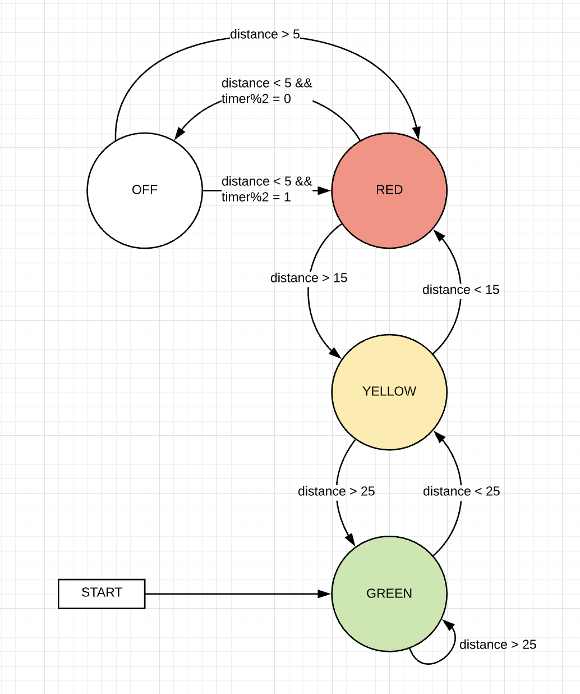

### Objectives

The purposes of this lab are to:
* Build an IoT sensor using GPIO pins for inputs
* Establish a machine-to-machine (M2M) communication protocol
* Design an IoT interaction between a sensor and an actuator.

### Materials

The materials used for this lab were
* Personal computer (MacBook Pro)
* 2 x ESP8266 Wemos D1 Mini (Microcontroller)
* 2 x USB -> MicroUSB cable for connecting the Microcontroller to the computer
* 2 x Breadboard
* 1 x Stop light LED component with built in resistors
* 1 x Hypersonic distance detector
* 9 x Male to male jumper cables

### References

1. [Arduino IDE Examples](https://www.arduino.cc/en/Tutorial/BuiltInExamples)
2. [ESP8266WiFi Docs](https://github.com/esp8266/Arduino/tree/master/libraries/ESP8266WiFi/examples)
3. [ESP8266HTTPClient Docs](https://github.com/esp8266/Arduino/tree/master/libraries/ESP8266HTTPClient)
4. [Arduino IDE](https://www.arduino.cc/en/main/software)
5. [Stoplight Lab](../lab-2)
6. [Guide On Arduino Ultrasonic Sensor](https://randomnerdtutorials.com/complete-guide-for-ultrasonic-sensor-hc-sr04/)

### Procedures

1. Set up stoplight with web server by following [Lab 2](../lab-2)
2. Set up your Arduino dev environment to work with the ESP8266 Wemos D1 Mini
    * Go to Preferences and add the following URL to the **Additional Boards Manager URLs** field
    ```md
    http://arduino.esp8266.com/stable/package_esp8266com_index.json
    ```
    * Go to `Tools -> Board: [Some Board Name] -> Boards Manager`
    * Search for _Wemos_
    * Install esp8266 by ESP8266 Community (_Note: this tutorial was made using verions 2.5.2 and does not guarantee that everything will work the exact same in later versions_)
    * Go to `Tools -> Board: [Some Board Name]` again and select the following board
    ```md
    LOLIN(WEMOS) D1 R2 & Mini
    ```
    * Go to `Tools -> Port` and select the port that your Arduino is plugged into. (If you have issues on this step, you can find help [here](https://learn.sparkfun.com/tutorials/usb-serial-driver-quick-install-/all))
    * Go to `Tools -> Erase Flash:` and select `All Flash Contents`
    * You are ready to start coding!
  3. Implement WiFi on the Arduino using the example WiFi setup by going to `File -> Examples -> ESP8266WiFi -> WiFiClientBasic`
  4. After you have tested that you are able to connect to network, you are ready to start setting your client you will use to send requests to the stop light
  5. Set up your client by first creating the client object by
  ```C#
  WifiClient client;
  HTTPClient http;
  ```
  6. This will create the objects needed to make an HTTP request
  7. You can make an HTTP request using the following format
  ```C#
    if (http.begin(client, [url])){
      int httpCode = http.GET();

      if (httpCode > 0){
        if (httpCode == HTTP_CODE_OK){
          String payload = http.getString();
          Serial.println(payload);
        }
      } else {
        Serial.printf("[HTTP] GET Failed, error: %s\n", http.errorToString(httpCode).c_str());
      }
      http.end();
    } else {
      Serial.println("[HTTP] Unable to connect");
    }
  ```
  8. After you have your function that will make your HTTP request to change the light, you will need to make sure that your pin setup is correct and all pins are set to the correct mode meaning
      * Trig Pin => OUTPUT
      * Echo Pin => INPUT
  9. Once you have this set up, you will need to add the code to your loop() function to make it so that you can get the distance of an object at any point.
      * You are going to do this by calculating the amount of time it takes for the sound to go out, bounce off the object you're measuring, and come back to the other sensor.
      * This can be accomplished using libraries, however, let's do it from sratch, for fun.
      * The way this works is the Trig Pin (Trigger) sends a frequency (of about 40kHz) out for 10 µs. The echo pin then takes this frequency back in and calculates the duration the frequency took to get from trigger to echo.
      * After you have this duration you can figure out how many cm away the object is by the equation `duration * 0.034 / 2`.
      * Here is all of that in code

      ```C#
        digitalWrite(trigPin, LOW);
        delayMicroseconds(2);
        digitalWrite(trigPin, HIGH);
        delayMicroseconds(10);
        digitalWrite(trigPin, LOW);
        duration = pulseIn(echoPin, HIGH);
        distance = duration * 0.034 / 2;
        Serial.println(distance);
      ```
  10. Now you have the distance of he object, you can do some nice if statements to figure out which light you should turn on. Once you have done this you have a stoplight that responds to a distance sensor and tells you whether to pull forward or not!

### Thought Questions

1. #### Think of the interaction between your devices. How well would this scale to multiple devices? Is it easy to add another sensor? Another actuator?
It wouldn't be awful to scale out a few more devices. The part that seems like it would be a headache is managing all of the IP addresses for the actuators. Having to keep that in sync with the sensors would be painful. I definitely think an event hub will solve this issue wonderfully.
2. #### What are strengths and weaknesses of the tennis-ball-on-a-string system that Don had originally? What are strengths and weaknesses of the IoT system that he developed? What enhancements would you suggest?
Some strengths of the tennis-ball-on-a-string is that it is simple. You are able to set it up in a couple of minutes and, quite frankly, it gets the job done. Some weaknesses of it is that it is an annoyance whenever the car isn't in the garage. There is just a tennis ball in the way of anything else you are trying to do in there. As well, there is a likelihood of the tennis ball falling off or getting knocked off. Some of the strengths of the IoT system is that it would be able to be a system that the driver would use every day. Drivers are very accustomed to stop lights and this would make it nice to be able to incorporate into a normal routine. Some weaknesses would be complexity and maintenance. This solution would need to be maintained in order for it to remain useful.
3. #### What was the biggest challenge you overcame in this lab?
When trying to get this lab up and running on BYU's campus, I ran into the captive portal of BYU-WiFi. I didn't know this was necessarily happening at first and so it caused me good amount of headache trying to debug. Once I realized that's what it was, it wasn't too bad to get my hotspot set up and all of my devices connected to it.
4. #### Please estimate the total time you spent on this lab and report.
3 hours

### Certification of Work

I certify that the solution presented in this lab represents my own work. In the case where I have borrowed code or ideas from another person, I have provided a link to the author’s work in the references, and included a citation in the comments of my code. 

-- Matthew Robertson

### Appendix
#### Appendix 1: System Interface - Web Page

State Diagram


#### Appendix 3: Code
Available on [GitHub](https://github.com/mattrobertson14/it441-arduino-distance-sensor)