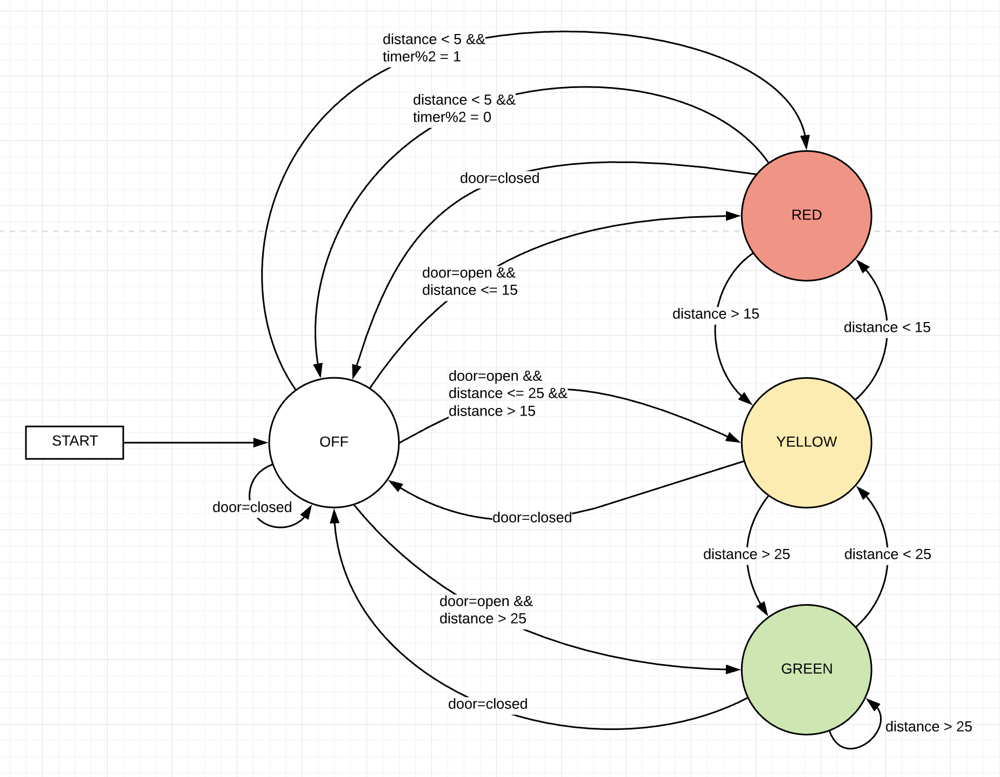
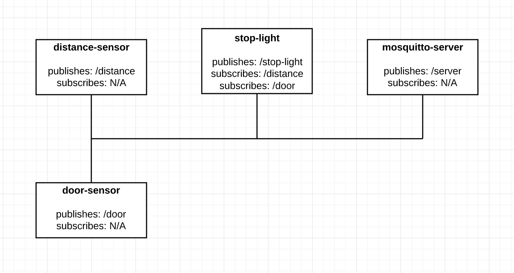

### Objectives

The purposes of this lab are to:
* Implement an Event Hub for publish/subscribe notifications between devices
* Develop a communications protocol for devices across the event bus
* Establish more complex conditions for the actuator involving multiple sensors 

### Materials

The materials used for this lab were
* Personal computer (MacBook Pro)
* 3 x ESP8266 Wemos D1 Mini (Microcontroller)
* 3 x USB -> MicroUSB cable for connecting the Microcontroller to the computer
* 3 x Breadboard
* 1 x Stop light LED component with built in resistors
* 1 x Hypersonic distance detector
* 1 x Magnetic door sensor
* 9 x Male to male jumper cables

### References

1. [Arduino IDE Examples](https://www.arduino.cc/en/Tutorial/BuiltInExamples)
2. [PubSubClient Docs](https://github.com/knolleary/pubsubclient)
3. [Arduino IDE](https://www.arduino.cc/en/main/software)
4. [MacOS Mosquitto Instructions](https://subscription.packtpub.com/book/application_development/9781787287815/1/ch01lvl1sec12/installing-a-mosquitto-broker-on-macos)
5. [Linux Mosquitto Instructions](http://www.steves-internet-guide.com/install-mosquitto-linux/)

### Procedures

1. Set up MQTT server/broker. This can be done by installing it on Linux or Mac using the following guides
    * [Linux](http://www.steves-internet-guide.com/install-mosquitto-linux/)
    * [MacOS](https://subscription.packtpub.com/book/application_development/9781787287815/1/ch01lvl1sec12/installing-a-mosquitto-broker-on-macos)
2. Set up your Arduino dev environment to work with the ESP8266 Wemos D1 Mini
    * Go to Preferences and add the following URL to the **Additional Boards Manager URLs** field
    ```md
    http://arduino.esp8266.com/stable/package_esp8266com_index.json
    ```
    * Go to `Tools -> Board: [Some Board Name] -> Boards Manager`
    * Search for _Wemos_
    * Install esp8266 by ESP8266 Community (_Note: this tutorial was made using verions 2.5.2 and does not guarantee that everything will work the exact same in later versions_)
    * Go to `Tools -> Board: [Some Board Name]` again and select the following board
    ```md
    LOLIN(WEMOS) D1 R2 & Mini
    ```
    * Go to `Tools -> Port` and select the port that your Arduino is plugged into. (If you have issues on this step, you can find help [here](https://learn.sparkfun.com/tutorials/usb-serial-driver-quick-install-/all))
    * Go to `Tools -> Erase Flash:` and select `All Flash Contents`
    * You are ready to start coding!
3. Implement WiFi on the 3 Arduinos for 3 different files: stoplight, distance sensor, and door sensor using the example WiFi setup by going to<br/>`File -> Examples -> ESP8266WiFi -> WiFiClientBasic`
    * Here are the libraries you'll need
    ```c#
    #include <ESP8266WiFi.h>
    #include <ESP8266WiFiMulti.h>
    ```
    * Here is the function to connect to wifi
    ```c#
    void connectToWifi(){
      WiFi.mode(WIFI_STA);
      wifiMulti.addAP(ssid1, passwd1);
      wifiMulti.addAP(ssid2, passwd2);
      
      Serial.print("\nConnecting");
      
      while (wifiMulti.run() != WL_CONNECTED){
        delay(500);
        Serial.print(".");
      }
      Serial.println();

      Serial.print("Connected to ");
      Serial.print(WiFi.SSID());
      Serial.print(", IP Address: ");
      Serial.println(WiFi.localIP());

      if (wifiMulti.run() == WL_CONNECTED){
        digitalWrite(BUILTIN_LED, LOW);
      }
    }
    ```
    * You should call the function above in the setup function
    ```c#
    void setup(){
      Serial.begin(115200);
      connectToWifi();
    }
    ```
4. After you have tested that you are able to connect to network, you are ready to start connecting all your devices to your HUB/broker
5. Use the following code exerpts to set up each device to talk on the event hub
    * Connect to the correct HUB by initializing a PubSubClient client and create a device name of your choosing
    ```c#
    WiFiClient wifiClient;
    PubSubClient client("broker-ip-addr", 1883, wifiClient);
    String device_name = "esp8266-[whatever name you want]";
    ```
    * Actually run the client's connection function
    ```c#
    while (!client.connected()){
      if (client.connect((char*) device_name.c_str())){
        Serial.println("Connected to MQTT Hub");
        String message = "Distance sensor (" + device_name + ") connected @ " + WiFi.localIP().toString();
        client.publish("[topic name]", message.c_str());
        client.subscribe("[topic name]"); // only if you are going to subscribe to any topic
      } else {
        Serial.println("Connection to MQTT failed, trying again...");
        delay(3000);
      }  
    } 
    ```
    * Check at the beginning of each loop to make sure that you're still connected and try and reconnect if not. If we are connected, we will run the clients loop inside of our loop
    ```c#
    void loop(){
    if (!client.connected()){
      reconnectToHub();
    }
    client.loop()
    ```
6. You can test no that each of your devices connect since they will all publish their IP to the hub. You can subscribe on the command line of the mosquitto broker to see all their connections come through with the following command
```bash
mosquitto_sub -t [topic-name] -v
```
7. Once you have confirmed that all of your devices are correctly talking to the HUB let's get the door sensor, the simplest sensor, up and running
    * Set up sensor by attaching one pin of the sensor to a pin, I used D6, on the Microcontroller. It doesn't matter which one you connect as either one will work for the sensor's circuitry. Connect the sensor's other pin to ground. Now that the sensor is connected we're ready to hook it up in the code
    * To do this you will want to make the pin type `INPUT_PULLUP`. This should be done in the setup() function. You can initialize the pin, D6 in this case, using the following
    ```c#
    pinMode(D6, INPUT_PULLUP);
    ```
    * Now all you'll want to do is watch to see if the pin changes from high to low of vice versa. Once it changes, you should publish this change onto the hub to tell everyone subscribed that the door status has changed. It is also worth while to send out a periodic status of the door in case any node connects in between state changes they can still get the current status.
8. Next we will want to set up the distance sensor. To do this, we will need to set up the same code as in [Lab 3](../lab-3). This will send out a hypersonic frequency and determine how far something is away based on the frequency that comes back. To do this, we will need to do the following
    * Initialize each pin in the setup function. The trig pin or trigger pin should be an OUTPUT pin and the echo pin should be an INPUT pin
    ```c#
    pinMode(trigPin, OUTPUT);
    pinMode(echoPin, INPUT);
    ```
    * Next, on every loop we should send out a frequency and listen for the response. With this response, we can determine the distance the object in front of the sensor is using what we know about the speed of sound. This will look something like this
    ```c#
    digitalWrite(trigPin, LOW);
    delayMicroseconds(2);
    digitalWrite(trigPin, HIGH);
    delayMicroseconds(10);
    digitalWrite(trigPin, LOW);
    duration = pulseIn(echoPin, HIGH);
    distance = duration * 0.034 / 2;
    ```
    * Using this distance, we can publish the current distance away something is based on the sensor's reading. To do this you should use the `client.publish([topic], [message]);` function. I chose to do this every second so that any given point anything subscribed to the distance should have a pretty accurate reading of the distance.
9. Now that we have our two sensors publishing to the event hub, we can consume that data to determine what color our stoplight should be. The basic idea is that a stoplight should be off if the garage door is closed (i.e. the door sensor reads closed) and on if the garage door is open (i.e. the door sensor reads open). The color of the stoplight should be determined by the distance sensor using the following ranges _(NOTE: All numbers are computed using the above distance algorithm and are measured in cm)_
>RED: < 15 and >= 5
>
>YELLOW: < 25 and >= 15
>
>GREEN >= 25
    * You'll notice that there is a hole in these ranges of less than 5. This is because when the distance reader is less than 5, the stoplight should flash red indicating that the car has gone too far and should back up. 
10. The stoplight should subscribe to the topic for the distance sensor and for the door sensor. This way, it will be able to know when there are changes and change accordingly.
11. That's it! You now have a stoplight that will change colors based on an objects distance and only function when the garage door is open. It also functions without using any kind of web server architecture! How amazing right?!

### Thought Questions

1. #### How does the communication between devices change with the shift to using an event hub? How does this facilitate greater scalability? What things did you do to learn to use MQTT?
Things no longer have to worry about staying up to date with everything via requests. Now, everything just listens to exactly the information they need and acts upon it accordingly. This infrastructure scales so much nicer. You are able to set up an infrastructure where things will publish and subscribe how you set up. Then, at a later date, there is no issue with adding something that will continue to consume the data that is already being published. Furthermore, if you add another sensor of some kind, the configuration can already be in all the devices to listen to that topic even before that sensor is put into place. I read a few posts about the idea of what MQTT was and why is was important. Most of my learning came from implementing the library PubSubClient into my devices. As well, I spent a little bit of time having 3 or 4 terminal windows open and publishing and subscribing from them. This helped me easily see in real time what was going on the event hub.

2. #### What are strengths and weaknesses of the direct communication between the sensor and actuator? What are strengths and weaknesses of the event hub? Which do you feel is better for this application?
I feel there are many strengths with this direct communication. I am able to easily know when something is updated for one or many devices. One weakness I found having to think differently about was the fact that requesting information isn’t where this direct communication shines. It was awkward at first when I was thinking of how to get some of the information because I kept thinking of it as a request/response system which is not how this should be architected. I do think that there are some cases where the request/response architecture still has its merit. I loved the event hub. I thought that being able to just spit information into the system and anyone can access it is absolutely incredible. It made connecting multiple devices a breeze. I feel that MQTT is hands-down the better solution for this application. I think that the ability to have the distance and door sensors information available to anyone who desires it makes this application run smoothly and be super scalable.

3. #### What was the biggest challenge you overcame in this lab?
The biggest challenge for me in this lab was learning how to respect the event hub as an event hub and not a different version of a web server. My mind kept reverting to the web server way of thinking for every little problem to solve and this was not the best way to go about things. Once I got into stride with thinking about the event hub for what it truly was, I was able to come up with much better and more practical solutions. I ran into a few other hiccups here and there with my logic in my stoplight. But overall, my biggest challenge was definitely figuring out how to holistically think differently.

4. #### Please estimate the total time you spent on this lab and report. 
5 hours

### Certification of Work

I certify that the solution presented in this lab represents my own work. In the case where I have borrowed code or ideas from another person, I have provided a link to the author’s work in the references, and included a citation in the comments of my code. 

-- Matthew Robertson

### Appendix
#### Appendix 1: DIAGRAMS

State Diagram


Logical Layout


#### Appendix 3: Code
Available on [GitHub](https://github.com/mattrobertson14/it441-mosquitto-hub)