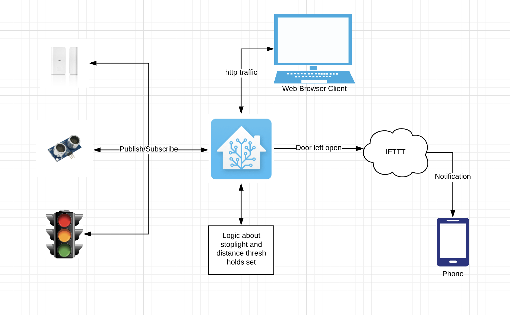

### Objectives

The purposes of this lab are to:
* Install an open source home automation platform
* Interface this platform via MQTT with your various devices
* Use Home Assistant to monitor the state of the garage door, and whether the car is parked in the garage. 

### Materials

The materials used for this lab were
* Personal computer (MacBook Pro)
* 3 x ESP8266 Wemos D1 Mini (Microcontroller)
* 3 x USB -> MicroUSB cable for connecting the Microcontroller to the computer
* 3 x Breadboard
* 1 x Stop light LED component with built in resistors
* 1 x Hypersonic distance detector
* 1 x Magnetic door sensor
* 9 x Male to male jumper cables
* 1 x Raspberry Pi 3

### References

1. [Arduino IDE Examples](https://www.arduino.cc/en/Tutorial/BuiltInExamples)
2. [PubSubClient Docs](https://github.com/knolleary/pubsubclient)
3. [Arduino IDE](https://www.arduino.cc/en/main/software)
4. [Install Home Assistant](https://www.home-assistant.io/getting-started/)
5. [Connecting Home Assistant to WiFi](https://unix.stackexchange.com/questions/420640/unable-to-connect-to-any-wifi-with-networkmanager-due-to-error-secrets-were-req)
6. [Connecting Home Assistant to IFTTT](https://www.home-assistant.io/integrations/ifttt/)

### Procedures

1. Download Hassio Home Assistant onto the Raspberry pi using the following instructions:
    * https://www.home-assistant.io/getting-started/
2. Next, you will need to make sure that you set up the network correctly. For me, I wasn't able to get the suggested USB network configuration file to work. Instead I used the `nmcli` approach.
    * First login to hassio with the command `login` after bootup (using root as the username)
    * Use the following command to see if the ssid you're going to try and connect to exists
    ```bash
    nmcli con show
    ```
    * Use the following command to delete that connection if it exists and make sure that you are starting from scratch
    ```bash
    nmcli con delete <SSID>
    ```
    * Use the following command to (re)add the new connection
    ```bash
    nmcli dev wifi connect <SSID> password <password>
    ```
    * Start up the new connection
    ```bash
    nmcli con up <WiFi Name>
    ```
3. Now you can connect to your new Home Assistant instance at the IP address it has or if you have mDNS discovery on your network you can go to `http://hassio.local:8123
4. Once you are connected to Home Assistance, you need to install the MQTT Add On
    * Go to the Hass.io Page and select the Add On tab
    * Search for MQTT
    * Click on the mosquitto broker and install it
    * Go to `Configuration > Users` and add a new username and password for the user that will be used to connect all the ESP-8266
5. Rewrite all of the Arduino code to connect to the new Home Assistant MQTT broker. After you have done this, remove all the logic from the stop-light that decided on what light it should be set to. This logic is going to be moved into home assistant using automations. You will need to add the following line to each of the setup functions of each Arduino.
```c#
client.connect((char*) device_id.c_str(), "[username]", "[password]");
client.publish("homeassistant/sensor/garage/[dev_name]/config", "{\"name\": \"[Device Name]\", \"state_topic\": \"/[Publish Topic]\"}");
```
6. Now that you have all of your devices registering themselves with home assistant you are ready to create your dashboard. You can do this by going to the `Overview` and click the edit button (it is a pencil).
    * You will then go to the add FAB at the bottom to add a card. 
    * Select sensor and select the 3 entities: door, distance-sensor, and stop-light
    * Now you will be able to see the state of these three different entities. 
7. Now it's time to add the logic to actually make the stop light work again. As previously stated, this logic is now going to be in Home Assistant. That means that we are going to need to add a hand full of automations. You should put an automation that will trigger on the mqtt topic of the distance sensor but only if the door sensor is open.
8. Once you have these automations up and running, you'll need to then set up some kind third party automation. I chose to use IFTTT to make it so that I would get a notification if the Garage Door was left open too long. 
9. To set up IFTTT, you need to do the following
    * Register with an IFTTT account on https://ifttt.com
    * Add webhook Applet and configure it to send a notification on the webhook of the garage door being left open
    * Then add an automation in Home Assistant that will hit that webhook on the trigger of the garage door being open for 10s and there is no change in the stoplight. 
10. Now you have a home assistant client that is set up to correctly change a stoplight and will send you a notification if your garage door has been left open for too long.

### Thought Questions

1. #### Which version of Home Assistant did you choose to install? (Docker-based Hass.io, Raspbian-based Hassbian, or install it yourself?) Why did you choose this particular version?
I used the Raspbian based Hass.io image. I used this because I was familiar with the installation process. I did try the .vhdx of hass.io but it was having some kernal issues when I was installing it with Hyper-V so I changed to the raspberry pi image.
2. #### How should you decide which logic to perform in Home Assistant versus coding the logic directly into the devices? What guiding principles would you establish for future devices?
In my mind it matters most about how quickly triggers need to cause things to happen in the system. In this case, where the stoplight needs to change super quickly as things change then the logic needs to be close to the stoplight. The stoplight should probably have the logic inside of it so it is the most repsonsive. However, if something doesn't need to be super responsive the logic can be in Home Assistant or the like.
3. #### What features do you like the most about Home Assistant?
The feature I like most about home assistant is the automation part. I really like that you can just set arbitrary triggers and have them set something into motion. This seems like it is extremely extendible. I also really like how you can have conditional triggers as well. It makes it so that the integrations can be much larger.
4. #### Please estimate the total time you spent on this lab and report. 
9 hrs

### Certification of Work

I certify that the solution presented in this lab represents my own work. In the case where I have borrowed code or ideas from another person, I have provided a link to the author’s work in the references, and included a citation in the comments of my code. 

-- Matthew Robertson

### Appendix
#### Appendix 1: DIAGRAMS

Logical Layout


#### Appendix 2: Code
Available on [GitHub](https://github.com/mattrobertson14/it441-home-assistant)